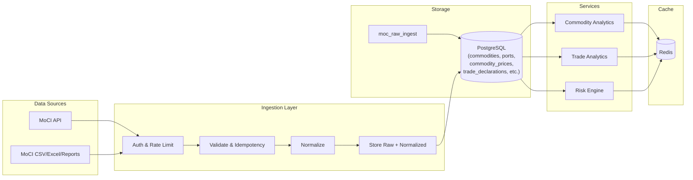

# TrueRate — Data Pipeline Design  
## Ministry Data Ingestion → Storage → Services → Frontend

**Document type:** Technical design  
**Version:** 1.0  
**Complements:** [data-flow.md](./data-flow.md), [system-architecture.md](./system-architecture.md)

---

## 1. Pipeline Overview

---

## 2. Ingestion Flow (Detail)

### 2.1 Trigger

| Mode | Trigger | Use case |
|------|---------|----------|
| **Scheduled** | Cron (e.g. `0 6 * * *` daily 06:00 UTC) | Commodity and trade sync. |
| **On-demand** | Admin or `npm run sync` | Initial load or recovery. |
| **Webhook** (future) | MoCI POST to our endpoint | If MoCI supports push. |

### 2.2 Steps

1. **Fetch:** Ingestion service calls MoCI endpoint(s) or receives file/webhook payload. Credentials from env (e.g. `MOC_API_KEY`, `MOC_COMMODITY_URL`, `MOC_IMPORT_URL`).  
2. **Validate:** Response validated (schema); invalid payloads logged, not stored.  
3. **Idempotency:** Check `(source, bulletin_id)` or payload checksum; skip if already in `moc_raw_ingest`.  
4. **Persist raw:** Insert into `moc_raw_ingest` (payload JSONB, checksum).  
5. **Normalize:** Map to canonical IDs (commodities, ports), then insert into:
   - Commodity path → `commodity_prices`, optional `commodity_price_snapshots`.
   - Trade path → `trade_declarations`, optional `import_summaries`.
6. **Log:** Success/partial/failure and counts in `ingestion_logs`.  
7. **Cache invalidation:** Clear or tag Redis keys for affected series (e.g. `tr:commodity:*`, `tr:trade:*`) so services serve fresh data.

### 2.3 Failure and Retry

- Retry with exponential backoff (configurable `RETRY_MAX_ATTEMPTS`, `RETRY_BASE_MS`).  
- After max retries: log to `ingestion_logs`, optional alert; no duplicate raw insert on retry (idempotency preserved).

---

## 3. Data Request Formats (Integration Points)

| Source | Preferred | Fallback | Implementation |
|--------|-----------|----------|----------------|
| Commodity prices | GET JSON API | CSV/Excel file | `services/ingestion` + `src/moc/normalize/commodity.ts` |
| Trade/import | GET JSON API | CSV/Excel file | `services/ingestion` + `src/moc/normalize/trade.ts` |
| Business licensing | GET API or CSV | Manual upload | To be added post-DSA |
| Aggregated complaints | JSON/CSV report | Email attachment | To be added post-DSA |

---

## 4. Database Schema (Summary)

- **Raw:** `moc_raw_ingest` — source, bulletin_id, payload (JSONB), checksum.  
- **Reference:** `commodities`, `ports` — external_id, name, unit, etc.  
- **Commodity:** `commodity_prices`, `commodity_price_snapshots` — price, effective_date, commodity_id, source.  
- **Trade:** `trade_declarations`, `import_summaries` — port_id, commodity_id, declaration_date, volume, value_*.  
- **Operational:** `ingestion_logs` — source, run_at, status, records_ok, records_fail, error_message.  

Full DDL: [database-schema.sql](./database-schema.sql). Overview: [data-schema-overview.md](./data-schema-overview.md).

---

## 5. Security Architecture

- **Ingestion only** talks to MoCI and PostgreSQL (and optionally Redis for idempotency/cache).  
- **No direct internet access** to PostgreSQL; all access from app/ingestion within private network or server-side only.  
- **Secrets:** MoCI credentials in env or vault; never in code or repo.  
- **Audit:** All ingest runs and errors in `ingestion_logs`; raw payloads kept for replay and compliance.

---

## 6. Outcomes

- **Reliable data pipeline** for commodity and trade data (existing); extensible to licensing and complaints once agreed.  
- **Clear integration blueprint** for API vs file-based delivery.  
- **Single place** for pipeline logic: `services/ingestion` and this doc.
