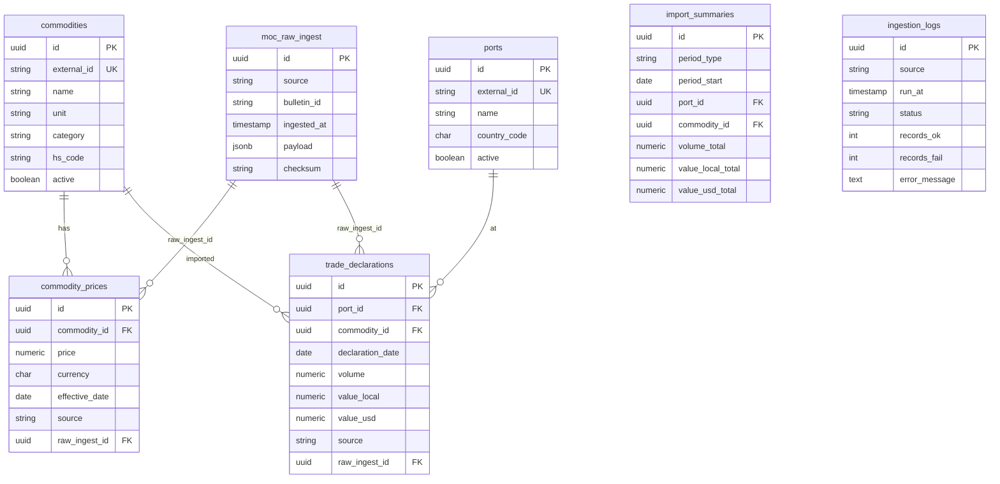

# TrueRate — Data Schema Overview  
## TrueRate Database Schema for Ministry Data Integration

**Document type:** Schema reference  
**Version:** 1.0  
**Full DDL:** [database-schema.sql](./database-schema.sql), [market-intelligence-schema.sql](./market-intelligence-schema.sql)

---

## 1. Schema Diagram (Logical)

---

## 2. Table Groups

### 2.1 Reference (Ministry alignment)

| Table | Purpose |
|-------|---------|
| **commodities** | Canonical list of commodities; `external_id` = MoCI commodity code/ID. |
| **ports** | Canonical list of ports; `external_id` = MoCI port code. |

### 2.2 Raw ingestion (audit & replay)

| Table | Purpose |
|-------|---------|
| **moc_raw_ingest** | Original payloads from MoCI; idempotency via `(source, bulletin_id)` or checksum. |

### 2.3 Commodity prices (from MoCI)

| Table | Purpose |
|-------|---------|
| **commodity_prices** | Time-series prices per commodity, effective_date, currency, unit. |
| **commodity_price_snapshots** | Optional daily min/max/avg/close per commodity for fast analytics. |

### 2.4 Trade / import (from MoCI)

| Table | Purpose |
|-------|---------|
| **trade_declarations** | Declaration-level or equivalent: port, commodity, date, volume, value_local, value_usd. |
| **import_summaries** | Aggregates by period_type, period_start, port, commodity. |

### 2.5 Risk (metadata; metrics often in Redis)

| Table | Purpose |
|-------|---------|
| **risk_limits** | Configurable limits (VaR, stress). |
| **risk_snapshots** | Stored snapshots of risk metrics for compliance/audit. |

### 2.6 Operational

| Table | Purpose |
|-------|---------|
| **ingestion_logs** | Per-run status, record counts, errors. |

---

## 3. Redis Key Design (Reference)

| Pattern | Purpose | TTL |
|---------|---------|-----|
| `tr:commodity:latest` | Latest price by commodity | 5 min |
| `tr:commodity:series:{id}:d` | Daily series | 15 min |
| `tr:trade:agg:port:{period}:{start}` | Trade aggregate by port | 1 h |
| `tr:trade:agg:commodity:{period}:{start}` | Trade aggregate by commodity | 1 h |
| `tr:risk:var:{market}` | Risk metrics | 5 min |
| `tr:idempotency:{source}:{bulletin_id}` | Idempotency guard | 24 h |
| `tr:rl:{client}:{window}` | Rate limit | 1 min / 1 h |

---

## 4. Future Extensions (Post-DSA)

- **Business licensing:** Table `business_licenses` is provided in [migrations/001_business_licenses.sql](./migrations/001_business_licenses.sql) (external_id, business_name, license_type, status, valid_from, valid_until, source). Apply when MoCI license data is available; then `lib/verification` can read from it.
- **Aggregated complaints:** e.g. `complaint_indicators` (period, region/category, count, no PII).  

These will be added in separate migrations when MoCI data and DSA are confirmed.
