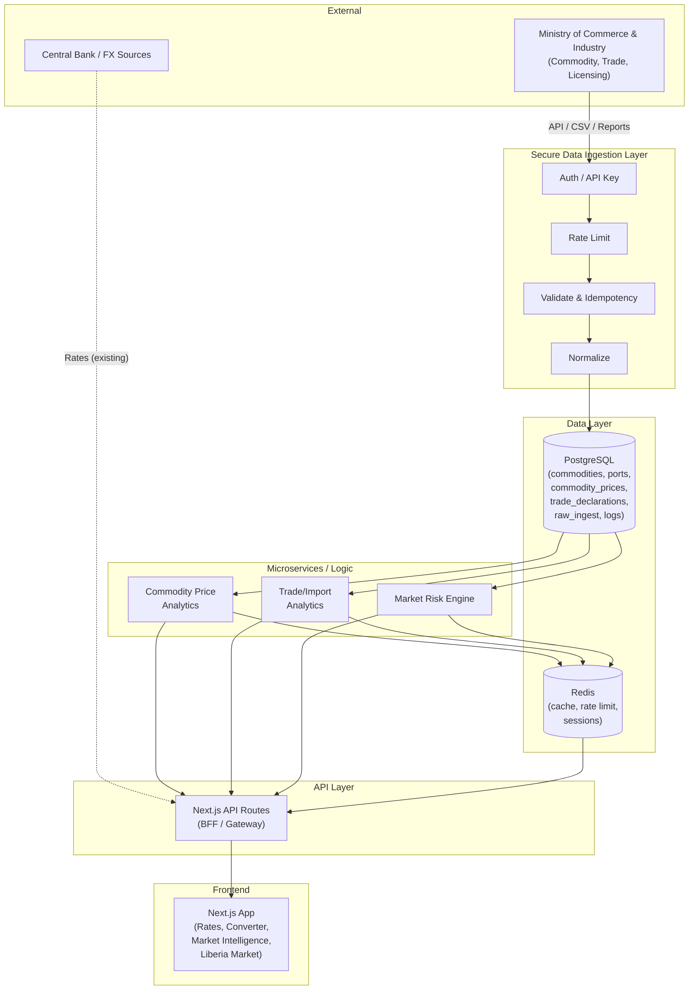
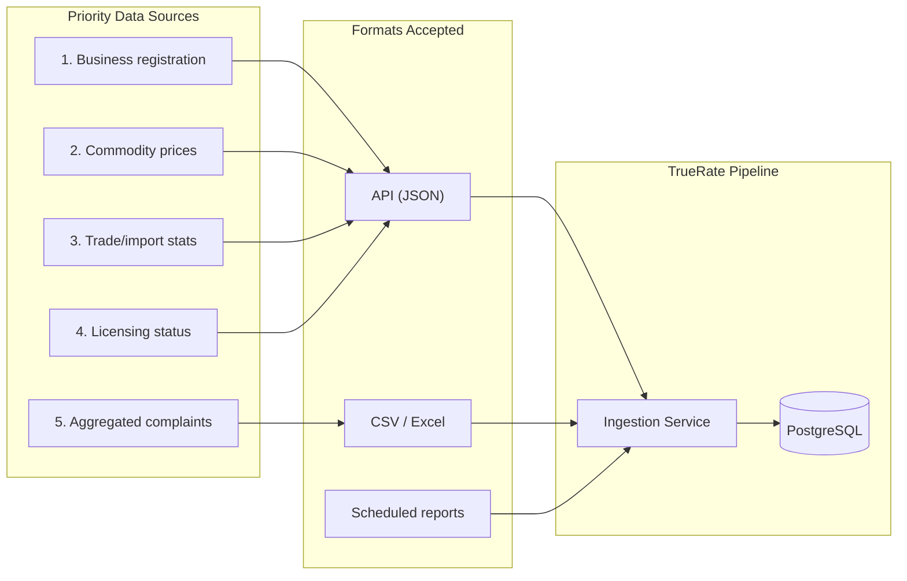

# TrueRate — System Architecture Diagram  
## End-to-End View (Ministry → User)

**Document type:** Architecture diagram  
**Version:** 1.0  
**Related:** [system-architecture.md](./system-architecture.md), [data-flow.md](./data-flow.md), [data-pipeline-design.md](./data-pipeline-design.md)

---

## 1. High-Level System Architecture (Mermaid)

---

## 2. Data Integration Blueprint (Phase 2 Outcome)

---

## 3. Deployment (Logical)

| Component | Deployment |
|-----------|------------|
| Ingestion | Node.js process (cron daemon or serverless); `services/ingestion`. |
| PostgreSQL | Managed (e.g. RDS, Supabase, Neon); schema from `database-schema.sql`. |
| Redis | Managed (e.g. ElastiCache, Upstash). |
| Next.js (BFF + Frontend) | Current host (e.g. Vercel); API routes under `app/api/`. |

---

*For narrative and security summary, see [system-architecture.md](./system-architecture.md).*
