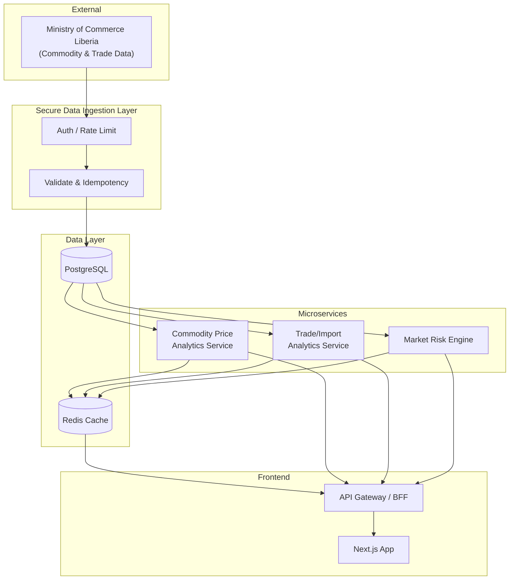

# TrueRate System Architecture

## Overview

TrueRate uses a **microservice architecture** to ingest government market data from the **Ministry of Commerce Liberia (MoC)**, run analytics and risk engines, and serve the Next.js frontend via a unified API layer.

### Architecture diagram (Mermaid)



### ASCII overview

```
┌─────────────────────────────────────────────────────────────────────────────────┐
│                              EXTERNAL                                            │
│  Ministry of Commerce Liberia (MoC) — Commodity prices, trade/import bulletins   │
└─────────────────────────────────────────────────────────────────────────────────┘
                                          │
                                          ▼
┌─────────────────────────────────────────────────────────────────────────────────┐
│                         SECURE DATA INGESTION LAYER                              │
│  • Auth (API key / mTLS for MoC)  • Rate limit  • Validation  • Idempotency     │
└─────────────────────────────────────────────────────────────────────────────────┘
                                          │
          ┌───────────────────────────────┼───────────────────────────────┐
          ▼                               ▼                               ▼
┌─────────────────────┐     ┌─────────────────────┐     ┌─────────────────────┐
│ Commodity Price     │     │ Trade/Import        │     │ Market Risk Engine   │
│ Analytics Service   │     │ Analytics Service   │     │                      │
│ (prices, indices)   │     │ (imports, tariffs)  │     │ (VaR, stress, limits)│
└─────────────────────┘     └─────────────────────┘     └─────────────────────┘
          │                               │                               │
          └───────────────────────────────┼───────────────────────────────┘
                                          ▼
┌─────────────────────────────────────────────────────────────────────────────────┐
│  PostgreSQL (primary)     │     Redis (cache, sessions, rate limits)             │
└─────────────────────────────────────────────────────────────────────────────────┘
                                          │
                                          ▼
┌─────────────────────────────────────────────────────────────────────────────────┐
│  API Gateway / BFF (Next.js API routes or standalone Node)                       │
└─────────────────────────────────────────────────────────────────────────────────┘
                                          │
                                          ▼
┌─────────────────────────────────────────────────────────────────────────────────┐
│  Next.js Frontend (existing app: rates, converter, analytics, Liberia market)   │
└─────────────────────────────────────────────────────────────────────────────────┘
```

## Components

### 1. External Data Source: Ministry of Commerce Liberia (MoC)

- **Commodity price bulletins** (e.g. rice, palm oil, cement) — periodic publications or APIs.
- **Trade/import data** — declarations, tariffs, volumes by commodity/port.
- **Integration:** Polling (scheduled jobs) or webhook/push if MoC provides; all access via the **Data Ingestion Layer**.

### 2. Secure Data Ingestion Layer

- **Single entry point** for all MoC-sourced data.
- **Authentication:** API keys or mTLS for MoC; internal service-to-service auth (JWT or API keys).
- **Rate limiting:** Protect MoC and internal services (Redis-backed).
- **Validation:** Schema validation (e.g. Zod/JSON Schema) before persisting.
- **Idempotency:** Idempotency keys to avoid duplicate ingestion for the same bulletin/date.
- **Output:** Writes raw and normalized payloads to PostgreSQL; publishes events (optional) for analytics/risk services.

### 3. Commodity Price Analytics Service

- **Input:** Ingested commodity price data from ingestion layer (DB or events).
- **Responsibilities:** Time-series aggregation, price indices, rolling stats (min/max/avg), alerts on thresholds.
- **Output:** REST/GraphQL API for Next.js; cached results in Redis (e.g. latest prices, 7/30/90-day series).

### 4. Trade/Import Analytics Service

- **Input:** Ingested trade/import data from ingestion layer.
- **Responsibilities:** Aggregation by commodity, port, period; trend analysis; tariff summaries.
- **Output:** REST API for dashboards and reports; Redis cache for hot queries.

### 5. Market Risk Engine

- **Input:** Commodity prices, FX rates (existing CBL/multi-source), optional trade exposure data.
- **Responsibilities:** Price volatility (e.g. standard deviation, VaR), stress scenarios, limit checks.
- **Output:** Risk metrics API; optional alerts (e.g. Webhook or queue) for breach of limits.

### 6. Data Stores

- **PostgreSQL:** Source of truth for ingested MoC data, analytics materialized views, user/session metadata, and audit logs.
- **Redis:** Caching (commodity prices, trade aggregates, risk metrics), session store, rate-limit counters, and optional job queues (Bull/BullMQ).

### 7. API Gateway / BFF

- **Role:** Aggregate responses from commodity, trade, and risk services; auth and rate limiting for frontend.
- **Implementation:** Next.js API routes (e.g. under `app/api/`) calling backend services, or a small Node.js BFF in front of Next.js.

### 8. Next.js Frontend

- **Existing app:** Rates, converter, predictions, analytics, Liberia market, community, dashboard.
- **New:** Pages/widgets for MoC commodity prices, trade/import analytics, and market risk views, consuming the BFF/gateway.

## Deployment (Logical)

- **Ingestion + services:** Deploy as separate Node.js processes (e.g. Docker containers or serverless functions); scale ingestion and analytics independently.
- **PostgreSQL:** Managed instance (e.g. AWS RDS, Supabase, Neon) with backups and read replicas for reporting.
- **Redis:** Managed (e.g. ElastiCache, Upstash) for cache and rate limiting.
- **Next.js:** Current Vercel/hosting; BFF can run in Next.js or as a separate Node service.

## Security Summary

- MoC credentials stored in secrets (env or vault); never in code.
- All MoC traffic through ingestion layer only; no direct DB access from internet.
- Service-to-service: network isolation + auth (JWT/API keys).
- PostgreSQL: encrypted at rest and in transit; least-privilege DB roles per service.
- Redis: AUTH and TLS where available; cache keys namespaced (e.g. `tr:commodity:*`).
